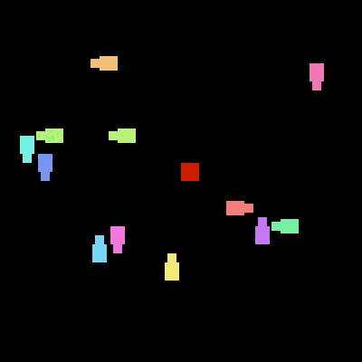

# MultiJSnake

[](https://github.com/surt91/multiJSnake/actions/workflows/maven.yml)

Snake played on a server -- communication happens mostly via Websockets.
Play it on [multijsnake.herokuapp.com](https://multijsnake.herokuapp.com/).
Either alone, with friends (via an invite link) or against computer players.



It also offers a mode to watch different neural net based autopilots at
[multijsnake.herokuapp.com/ai](https://multijsnake.herokuapp.com/ai),
which are executed in your browser.


## Setup

You need Java 11 with Maven for the backend and `npm` to build the frontend. With these prerequisites the server can 
be built and started on `http://localhost:8080` with:

```bash
./mvnw spring-boot:run
```

## Training an autopilot

You can train a neural net to play the game with the scripts in [`src/main/py`](/tree/main/src/main/py).
As prerequisites there must be Python 3.6+ available and the dependencies from `requirements.txt` need 
to be installed, e.g., with `pip install -r requirements.txt`.  

For converting the file with the trained model into a format suitable for `tensorflowjs` use:
````bash
tensorflowjs_converter --input_format=keras /tmp/model.h5 /tmp/tfjs_model
```

## Tests

There are unit tests of the backend and end-to-end tests using cypress. You can run them via

```bash
./mvnw test
npm run cy
```
